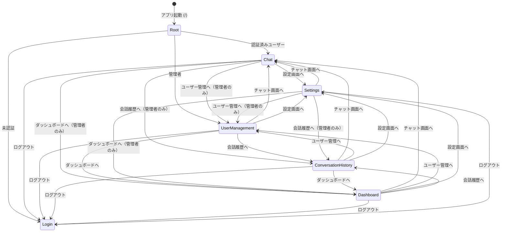

# 機能一覧

**作成日:** 2025-10-28
**最終更新:** 2025-12-31
**バージョン:** 1.5
**対象システム:** フルスタックWebアプリケーション

---

## 1. 概要

本ドキュメントでは、Webアプリケーションに実装されている全機能を一覧化します。

**関連ドキュメント:**
- [システム構成設計書](./01_system-architecture.md) - アーキテクチャ、技術スタック
- [データベース設計書](./04_database-design.md) - データベーススキーマ、ER図

---

## 2. 機能マップ

```mermaid
graph TB
    System["Webアプリケーション"]

    System --> Auth["認証機能"]
    System --> UserMgmt["ユーザー管理機能"]
    System --> AIChat["AIチャット機能"]
    System --> AdminMgmt["管理者機能"]
    System --> Common["共通機能"]

    Auth --> Login["ログイン"]
    Auth --> Logout["ログアウト"]
    Auth --> TokenRefresh["トークン自動更新"]

    UserMgmt --> UserList["ユーザー一覧取得"]
    UserMgmt --> UserCreate["ユーザー作成"]
    UserMgmt --> ProfileUpdate["プロフィール更新"]
    UserMgmt --> UserDelete["ユーザー削除"]
    UserMgmt --> PasswordChange["パスワード変更"]
    UserMgmt --> PasswordReset["パスワードリセット（管理者）"]

    AIChat --> ConversationList["会話一覧表示"]
    AIChat --> NewConversation["新規会話作成"]
    AIChat --> SendMessage["メッセージ送信"]
    AIChat --> StreamingResponse["ストリーミング応答"]
    AIChat --> DeleteConversation["会話削除"]

    AdminMgmt --> AdminConversationList["会話履歴一覧"]
    AdminMgmt --> AdminConversationDetail["会話詳細表示"]
    AdminMgmt --> AdminDashboard["ダッシュボード"]
    AdminMgmt --> AdminDashboardTrends["トレンド分析"]
    AdminMgmt --> AdminDashboardRankings["ユーザーランキング"]

    Common --> Logging["ロギング"]
    Common --> ErrorHandle["エラーハンドリング"]
    Common --> Validation["バリデーション"]
    Common --> Security["セキュリティ"]

    style System fill:#e1f5ff
    style Auth fill:#fff4e6
    style UserMgmt fill:#e8f5e9
    style AIChat fill:#e3f2fd
    style AdminMgmt fill:#fce4ec
    style Common fill:#f3e5f5
```

---

## 3. 機能詳細

### 3.1 認証機能

| 機能 | エンドポイント | 実装箇所 | 主な仕様 |
|------|--------------|---------|---------|
| **ログイン** | `POST /api/auth/login` | FE: `LoginPage.tsx` BE: `auth_routes.py` | - メール/パスワード認証 - httpOnly Cookie (access_token, refresh_token) - bcrypt パスワードハッシュ化 |
| **ログアウト** | `POST /api/auth/logout` | FE: `AuthContext.tsx` BE: `auth_routes.py` | - リフレッシュトークン無効化 - Cookie クリア |
| **トークン更新** | `POST /api/auth/refresh` | FE: `AuthContext.tsx` BE: `auth_routes.py` | - 自動トークンリフレッシュ - トークンローテーション |

---

### 3.2 ユーザー管理機能

| 機能 | エンドポイント | 実装箇所 | 主な仕様 |
|------|--------------|---------|---------|
| **ユーザー一覧取得** | `GET /api/users` | FE: `UserManagementPage.tsx` BE: `user_routes.py` | - 管理者のみアクセス可能 - 全ユーザーの情報を取得 |
| **ユーザー作成** | `POST /api/users` | FE: `UserCreateForm.tsx` BE: `user_routes.py` | - 管理者のみアクセス可能 - ランダムな初期パスワードを生成 - 作成後に初期パスワードを表示 - ロール指定可能（user/admin） |
| **プロフィール更新** | `PATCH /api/users/me` | FE: `SettingsPage.tsx` BE: `user_routes.py` | - 認証済みユーザーが自身のプロフィールを更新 - メールアドレスと名前の変更 |
| **ユーザー削除** | `DELETE /api/users/{id}` | FE: `UserList.tsx` BE: `user_routes.py` | - 管理者のみアクセス可能 - 指定したユーザーを削除 |
| **パスワード変更** | `POST /api/password/change` | FE: `SettingsPage.tsx` BE: `password_routes.py` | - 認証済みユーザーが自身のパスワードを変更 - 現在のパスワード確認が必要 - 新パスワードのバリデーション（8文字以上、英数字） |
| **パスワードリセット（管理者用）** | `POST /api/users/{id}/reset-password` | FE: `UserList.tsx` BE: `user_routes.py` | - 管理者のみアクセス可能 - ランダムな新パスワードを生成 - 新パスワードを画面に表示 |

---

### 3.3 AIチャット機能

| 機能 | エンドポイント | 実装箇所 | 主な仕様 |
|------|--------------|---------|---------|
| **会話一覧取得** | `GET /api/conversations` | FE: `ChatPage.tsx` BE: `conversation_routes.py` | - 認証済みユーザーの会話一覧取得 - ページネーション対応 - メッセージ数を含む情報 |
| **新規会話作成** | `POST /api/conversations` | FE: `ChatPage.tsx` BE: `conversation_routes.py` | - 初期メッセージ付きで会話を作成 - LangGraph ReAct + Claude による応答生成 - ツール呼び出し履歴を保存 - レート制限: 30リクエスト/分 |
| **会話詳細取得** | `GET /api/conversations/{uuid}` | FE: `ChatPage.tsx` BE: `conversation_routes.py` | - 会話の全メッセージを取得 - アクセス権限の検証 |
| **メッセージ送信** | `POST /api/conversations/{uuid}/messages` | FE: `ChatPage.tsx` BE: `conversation_routes.py` | - LangGraph ReAct + Claude による応答生成 - SSEストリーミング対応（ツール呼び出しイベントあり） - レート制限: 30リクエスト/分 |
| **会話削除** | `DELETE /api/conversations/{uuid}` | FE: `ChatPage.tsx` BE: `conversation_routes.py` | - 会話とメッセージをカスケード削除 - 所有者のみ削除可能 |

---

### 3.4 管理者機能

| 機能 | エンドポイント | 実装箇所 | 主な仕様 |
|------|--------------|---------|---------|
| **会話履歴一覧** | `GET /api/admin/conversations` | FE: `ConversationHistoryPage.tsx` BE: `admin_conversation_routes.py` | - 管理者のみアクセス可能 - 全ユーザーの会話一覧取得 - ページネーション対応 - ユーザーID/日付範囲でフィルタリング |
| **会話詳細表示** | `GET /api/admin/conversations/{uuid}` | FE: `ConversationDetailModal.tsx` BE: `admin_conversation_routes.py` | - 管理者のみアクセス可能 - 会話の全メッセージ表示 - ユーザー情報を含む |
| **ダッシュボードサマリー** | `GET /api/admin/dashboard/summary` | FE: `DashboardPage.tsx` BE: `admin_dashboard_routes.py` | - 管理者のみアクセス可能 - 総ユーザー数、アクティブユーザー数 - 会話数、メッセージ数 - トークン使用量、コスト表示 |
| **トレンド分析** | `GET /api/admin/dashboard/trends` | FE: `DashboardPage.tsx` BE: `admin_dashboard_routes.py` | - 管理者のみアクセス可能 - 期間指定（7d/30d/90d/カスタム） - メトリクス選択（会話/メッセージ/トークン） - グラフ表示用データ |
| **ユーザーランキング** | `GET /api/admin/dashboard/rankings` | FE: `DashboardPage.tsx` BE: `admin_dashboard_routes.py` | - 管理者のみアクセス可能 - メトリクス別ランキング - 期間フィルタリング対応 - 上位ユーザー表示 |

---

### 3.5 共通機能

| 機能 | 実装箇所 | 主な仕様 |
|------|---------|---------|
| **UIコンポーネントライブラリ** | FE: `components/ui/` | - Tailwind CSSベースの共有コンポーネント - Button, Input, Alert, Modalの4種類 - アクセシビリティ対応 (44px tap target, ARIA) - 一貫したデザインシステム - 詳細は [フロントエンドガイド](../frontend/CLAUDE.md#ui-component-library) 参照 |
| **ロギング** | BE: `logger.py` FE: `lib/logger.ts` | - リクエストトレーシング (UUID) - センシティブデータマスキング - 環境別ログレベル設定 - 詳細は [システム構成設計書](./01_system-architecture.md) セクション6参照 |
| **エラーハンドリング** | BE: `main.py` FE: `ErrorBoundary.tsx` | **バックエンド:** HTTP例外の統一処理 (400/401/403/404/500) **フロントエンド:** React Error Boundary、フォールバックUI |
| **バリデーション** | BE: `schemas/` FE: 各フォームコンポーネント | **バックエンド:** Pydantic による厳格な入力検証 **フロントエンド:** リアルタイムバリデーション、HTML5属性 |
| **セキュリティ** | BE: `utils/`, `auth_routes.py` FE: `AuthContext.tsx` | - JWT認証 (httpOnly Cookie) - bcryptハッシュ化 - トークンローテーション - 詳細は [認証・認可設計書](./02_authentication-authorization.md) 参照 |

---

## 4. 機能マトリクス

### 4.1 実装状況

| 機能カテゴリ | 機能名 | バックエンド | フロントエンド | テスト |
|------------|-------|------------|-------------|-------|
| 認証 | ログイン | ✓ | ✓ | BE: ✓, FE: ✓ |
| 認証 | ログアウト | ✓ | ✓ | BE: ✓, FE: ✓ |
| 認証 | トークン自動更新 | ✓ | ✓ | BE: ✓, FE: ✓ |
| ユーザー管理 | ユーザー一覧取得 | ✓ | ✓ | BE: ✓, FE: ✓ |
| ユーザー管理 | ユーザー作成 | ✓ | ✓ | BE: ✓, FE: ✓ |
| ユーザー管理 | プロフィール更新 | ✓ | ✓ | BE: ✓, FE: ✓ |
| ユーザー管理 | ユーザー削除 | ✓ | ✓ | BE: ✓, FE: ✓ |
| ユーザー管理 | パスワード変更 | ✓ | ✓ | BE: ✓, FE: ✓ |
| ユーザー管理 | パスワードリセット（管理者用） | ✓ | ✓ | BE: ✓, FE: ✓ |
| AIチャット | 会話一覧取得 | ✓ | ✓ | BE: ✓ |
| AIチャット | 新規会話作成 | ✓ | ✓ | BE: ✓ |
| AIチャット | 会話詳細取得 | ✓ | ✓ | BE: ✓ |
| AIチャット | メッセージ送信 | ✓ | ✓ | BE: ✓ |
| AIチャット | 会話削除 | ✓ | ✓ | BE: ✓ |
| 管理者機能 | 会話履歴一覧 | ✓ | ✓ | BE: ✓ |
| 管理者機能 | 会話詳細表示 | ✓ | ✓ | BE: ✓ |
| 管理者機能 | ダッシュボードサマリー | ✓ | ✓ | BE: ✓ |
| 管理者機能 | トレンド分析 | ✓ | ✓ | BE: ✓ |
| 管理者機能 | ユーザーランキング | ✓ | ✓ | BE: ✓ |
| 共通 | UIコンポーネントライブラリ | - | ✓ | FE: ✓ |
| 共通 | ロギング | ✓ | ✓ | - |
| 共通 | エラーハンドリング | ✓ | ✓ | BE: ✓, FE: ✓ |
| 共通 | バリデーション | ✓ | ✓ | BE: ✓, FE: ✓ |
| 共通 | セキュリティ | ✓ | ✓ | BE: ✓ |

**凡例:**
- BE: バックエンドテスト（pytest）
- FE: フロントエンドテスト（Vitest）

### 4.2 共通機能詳細

| 機能 | 実装箇所 | 詳細 |
|------|---------|------|
| **レート制限** | BE: `limiter.py` BE: `routes/auth_routes.py` BE: `routes/conversation_routes.py` | - Flask-Limiter + Redis による実装 - 認証エンドポイントに制限適用   - ログイン: 10req/分   - トークン更新: 30req/分   - ログアウト: 20req/分 - AIチャットエンドポイントに制限適用   - 会話作成: 30req/分   - メッセージ送信: 30req/分 - 429エラーレスポンス |

---

## 5. API エンドポイント一覧

### 5.1 システム監視

| 機能 | エンドポイント | 実装箇所 | 詳細 |
|------|--------------|---------|------|
| **ヘルスチェック** | `GET /api/health` | FE: `useVersion.ts` BE: `health.py` | アプリケーションとデータベースの状態確認。 **レスポンス例**: `{"status": "healthy", "database": "connected", "version": "v1.0.0"}` **ステータスコード**: 200 OK（正常）/ 503 Service Unavailable（異常） |
| **バージョン表示** | - | FE: `PageHeader.tsx` FE: `useVersion.ts` | ヘッダー右上にアプリケーションバージョンを表示。 `/api/health` から取得した `APP_VERSION` 環境変数の値を表示。 **デスクトップ**: 表示 **モバイル**: 非表示 |

### 5.2 認証 API

| メソッド | エンドポイント | 認証 | 説明 |
|---------|--------------|------|------|
| POST | `/api/auth/login` | 不要 | ログイン |
| POST | `/api/auth/logout` | 不要 | ログアウト |
| POST | `/api/auth/refresh` | 不要 | トークン更新 |

**認証方法:** Cookie ベース (httpOnly Cookie に JWT トークンを含む)

### 5.3 ユーザー管理 API

| メソッド | エンドポイント | 認証 | 権限 | 説明 |
|---------|--------------|------|------|------|
| GET | `/api/users` | 必要 | 管理者のみ | ユーザー一覧取得 |
| POST | `/api/users` | 必要 | 管理者のみ | ユーザー作成 |
| PATCH | `/api/users/me` | 必要 | 全ユーザー | プロフィール更新 |
| DELETE | `/api/users/{id}` | 必要 | 管理者のみ | ユーザー削除 |
| POST | `/api/users/{id}/reset-password` | 必要 | 管理者のみ | パスワードリセット |

### 5.4 パスワード管理 API

| メソッド | エンドポイント | 認証 | 権限 | 説明 |
|---------|--------------|------|------|------|
| POST | `/api/password/change` | 必要 | 全ユーザー | パスワード変更 |

### 5.5 AIチャット API

| メソッド | エンドポイント | 認証 | 権限 | 説明 |
|---------|--------------|------|------|------|
| GET | `/api/conversations` | 必要 | 全ユーザー | 会話一覧取得（ページネーション対応） |
| POST | `/api/conversations` | 必要 | 全ユーザー | 新規会話作成（初期メッセージ付き） |
| GET | `/api/conversations/{uuid}` | 必要 | 所有者のみ | 会話詳細取得（全メッセージ含む） |
| DELETE | `/api/conversations/{uuid}` | 必要 | 所有者のみ | 会話削除 |
| POST | `/api/conversations/{uuid}/messages` | 必要 | 所有者のみ | メッセージ送信（SSEストリーミング対応） |

### 5.6 管理者用 API

| メソッド | エンドポイント | 認証 | 権限 | 説明 |
|---------|--------------|------|------|------|
| GET | `/api/admin/conversations` | 必要 | 管理者のみ | 全ユーザーの会話一覧取得（フィルタリング対応） |
| GET | `/api/admin/conversations/{uuid}` | 必要 | 管理者のみ | 会話詳細取得（ユーザー情報含む） |
| GET | `/api/admin/dashboard/summary` | 必要 | 管理者のみ | ダッシュボードサマリー取得 |
| GET | `/api/admin/dashboard/trends` | 必要 | 管理者のみ | トレンドデータ取得（グラフ用） |
| GET | `/api/admin/dashboard/rankings` | 必要 | 管理者のみ | ユーザーランキング取得 |

**クエリパラメータ（会話一覧）:**
- `page`: ページ番号（デフォルト: 1）
- `per_page`: 1ページあたりの件数（デフォルト: 20）
- `user_id`: ユーザーIDでフィルタリング
- `start_date`: 開始日（ISO形式）
- `end_date`: 終了日（ISO形式）

**クエリパラメータ（トレンド）:**
- `period`: 期間（`7d` | `30d` | `90d` | `custom`、デフォルト: 30d）
- `metric`: メトリクス（`conversations` | `messages` | `tokens`、デフォルト: conversations）
- `start_date`: 開始日（YYYY-MM-DD、period=custom時必須）
- `end_date`: 終了日（YYYY-MM-DD、period=custom時必須）

**クエリパラメータ（ランキング）:**
- `metric`: メトリクス（`conversations` | `messages` | `tokens`、デフォルト: conversations）
- `limit`: 取得件数（デフォルト: 10、最大: 50）
- `period`: 期間（`7d` | `30d` | `90d` | `all`、デフォルト: all）

**ストリーミング応答:**
- デフォルトでSSE（Server-Sent Events）ストリーミングが有効
- `X-Stream: false` ヘッダーで非ストリーミングモードに切り替え可能
- 会話作成 (`POST /api/conversations`): `conversation_created`, `tool_call_start`, `tool_call_end`, `content_delta`, `message_end`, `error`
- メッセージ送信 (`POST /api/conversations/{uuid}/messages`): `message_start`, `tool_call_start`, `tool_call_end`, `content_delta`, `message_end`, `error`

**非ストリーミング応答:**
- `message`/`assistant_message`/`user_message` の各オブジェクトに `tool_calls` 配列が含まれる

---

## 6. 画面一覧

### 6.1 画面構成

| 画面名 | パス | 認証 | 権限 | 説明 | ファイル |
|-------|------|------|------|------|---------|
| ログイン画面 | `/login` | 不要 | - | ユーザー認証 | `LoginPage.tsx` |
| チャット画面 | `/chat`, `/chat/:uuid` | 必要 | 全ユーザー | AIチャット、会話管理 | `ChatPage.tsx` |
| 設定画面 | `/settings` | 必要 | 全ユーザー | プロフィール編集、パスワード変更 | `SettingsPage.tsx` |
| ユーザー管理画面 | `/admin/users` | 必要 | 管理者のみ | ユーザー一覧表示、作成、削除 | `UserManagementPage.tsx` |
| 会話履歴管理画面 | `/admin/conversations` | 必要 | 管理者のみ | 全ユーザーの会話履歴閲覧 | `ConversationHistoryPage.tsx` |
| ダッシュボード画面 | `/admin/dashboard` | 必要 | 管理者のみ | 統計サマリー、トレンド、ランキング | `DashboardPage.tsx` |

### 6.2 画面遷移図

---

## 7. 関連ドキュメント

- [認証・認可設計書](./02_authentication-authorization.md) - 認証フロー、トークン仕様、セキュリティ対策
- [システム構成設計書](./01_system-architecture.md) - アーキテクチャ、技術スタック、開発環境
- [データベース設計書](./04_database-design.md) - データベーススキーマ、ER図、テーブル定義
- [バックエンドガイド](../backend/CLAUDE.md) - バックエンド実装ガイド
- [フロントエンドガイド](../frontend/CLAUDE.md) - フロントエンド実装ガイド

---

**END OF DOCUMENT**
