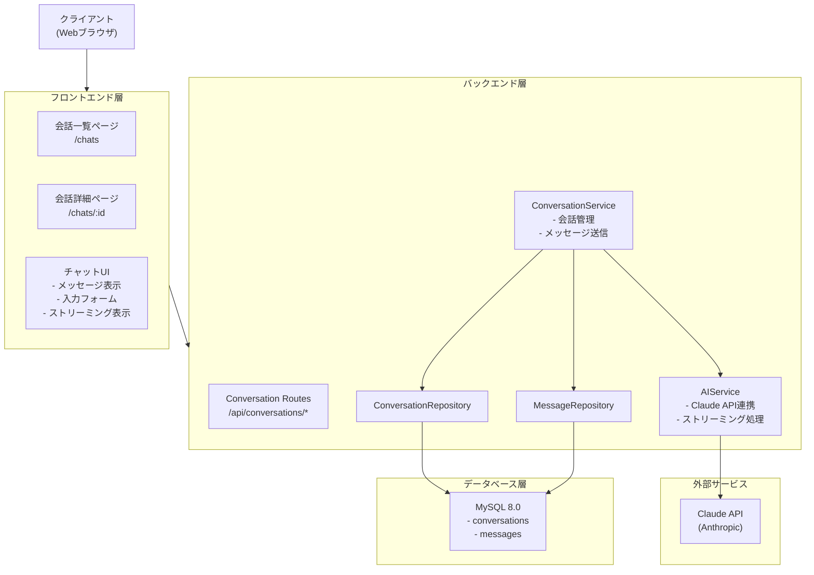
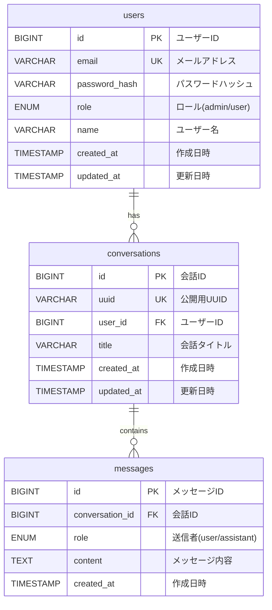

# AIチャットアプリ設計書

**作成日:** 2025-12-14
**バージョン:** 1.0
**ステータス:** ドラフト

---

## 1. 概要

### 1.1 目的

既存の認証機能を持つフルスタックWebアプリケーションを、AIチャットアプリケーションに拡張する。ユーザーはAI（Claude）と会話でき、会話履歴を保存・管理できる。

### 1.2 要件

1. **会話履歴の確認**: ユーザーは自分の過去の会話履歴を確認できる
2. **会話の継続**: 過去の会話の続きをすることができる
3. **URL によるアクセス**: 過去の会話はそれぞれ固有のURLを持ち、URLを指定することで特定の会話を確認できる
4. **アクセス制御**: 自分の会話は他のユーザーは確認できない

### 1.3 スコープ

**含まれるもの:**
- AIチャット機能（Claude API連携）
- 会話履歴の保存・取得
- 会話のCRUD操作
- ストリーミングレスポンス対応

**含まれないもの（将来の拡張）:**
- ファイルアップロード（画像・ドキュメント）
- 会話のエクスポート機能
- 会話の共有機能
- 複数AIモデルの選択

---

## 2. システムアーキテクチャ

### 2.1 全体構成



### 2.2 レイヤー構成（既存パターンに準拠）

```
backend/app/
├── routes/
│   └── conversation_routes.py  # 新規: 会話API
├── services/
│   ├── conversation_service.py # 新規: 会話ビジネスロジック
│   └── ai_service.py           # 新規: AI連携サービス
├── repositories/
│   ├── conversation_repository.py  # 新規
│   └── message_repository.py       # 新規
├── models/
│   ├── conversation.py         # 新規
│   └── message.py              # 新規
└── schemas/
    └── conversation.py         # 新規: リクエスト/レスポンススキーマ
```

---

## 3. データモデル設計

### 3.1 ER図



### 3.2 テーブル定義

#### conversations テーブル

会話（チャットスレッド）を管理するテーブル。

| カラム名 | データ型 | 制約 | 説明 |
|---------|---------|------|------|
| id | BIGINT UNSIGNED | PRIMARY KEY, AUTO_INCREMENT | 内部ID |
| uuid | VARCHAR(36) | NOT NULL, UNIQUE | 公開用UUID（URLで使用） |
| user_id | BIGINT UNSIGNED | NOT NULL, FOREIGN KEY | 所有ユーザーID |
| title | VARCHAR(255) | NOT NULL | 会話タイトル |
| created_at | TIMESTAMP | NOT NULL, DEFAULT NOW | 作成日時 |
| updated_at | TIMESTAMP | NOT NULL, ON UPDATE NOW | 更新日時 |

**インデックス:**
- `idx_conversations_user_id` on `user_id` (ユーザー別会話検索)
- `idx_conversations_uuid` on `uuid` (UUID検索)
- `idx_conversations_updated_at` on `updated_at` (最新順ソート)

**外部キー:**
- `user_id` → `users.id` (ON DELETE CASCADE)

**ビジネスルール:**
- `uuid` はUUID v4形式で自動生成
- `title` は最初のユーザーメッセージから自動生成（最大50文字）
- ユーザー削除時、関連する会話も削除される

#### messages テーブル

会話内の個々のメッセージを管理するテーブル。

| カラム名 | データ型 | 制約 | 説明 |
|---------|---------|------|------|
| id | BIGINT UNSIGNED | PRIMARY KEY, AUTO_INCREMENT | メッセージID |
| conversation_id | BIGINT UNSIGNED | NOT NULL, FOREIGN KEY | 所属会話ID |
| role | ENUM('user', 'assistant') | NOT NULL | 送信者ロール |
| content | TEXT | NOT NULL | メッセージ内容 |
| created_at | TIMESTAMP | NOT NULL, DEFAULT NOW | 作成日時 |

**インデックス:**
- `idx_messages_conversation_id` on `conversation_id` (会話別メッセージ取得)
- `idx_messages_created_at` on `created_at` (時系列ソート)

**外部キー:**
- `conversation_id` → `conversations.id` (ON DELETE CASCADE)

**ビジネスルール:**
- `role` は 'user'（ユーザー発言）または 'assistant'（AI発言）
- メッセージは作成後、編集不可（イミュータブル）
- 会話削除時、関連するメッセージも削除される

### 3.3 SQLAlchemy モデル

```python
# backend/app/models/conversation.py
from sqlalchemy import BigInteger, String, ForeignKey, DateTime
from sqlalchemy.orm import Mapped, mapped_column, relationship
from datetime import datetime
import uuid

class Conversation(Base):
    __tablename__ = "conversations"

    id: Mapped[int] = mapped_column(BigInteger, primary_key=True, autoincrement=True)
    uuid: Mapped[str] = mapped_column(String(36), unique=True, nullable=False, default=lambda: str(uuid.uuid4()))
    user_id: Mapped[int] = mapped_column(BigInteger, ForeignKey("users.id", ondelete="CASCADE"), nullable=False)
    title: Mapped[str] = mapped_column(String(255), nullable=False)
    created_at: Mapped[datetime] = mapped_column(DateTime, nullable=False, default=datetime.utcnow)
    updated_at: Mapped[datetime] = mapped_column(DateTime, nullable=False, default=datetime.utcnow, onupdate=datetime.utcnow)

    # Relationships
    user: Mapped["User"] = relationship("User", back_populates="conversations")
    messages: Mapped[list["Message"]] = relationship("Message", back_populates="conversation", cascade="all, delete-orphan")
```

```python
# backend/app/models/message.py
from sqlalchemy import BigInteger, Text, Enum, ForeignKey, DateTime
from sqlalchemy.orm import Mapped, mapped_column, relationship
from datetime import datetime
import enum

class MessageRole(str, enum.Enum):
    USER = "user"
    ASSISTANT = "assistant"

class Message(Base):
    __tablename__ = "messages"

    id: Mapped[int] = mapped_column(BigInteger, primary_key=True, autoincrement=True)
    conversation_id: Mapped[int] = mapped_column(BigInteger, ForeignKey("conversations.id", ondelete="CASCADE"), nullable=False)
    role: Mapped[MessageRole] = mapped_column(Enum(MessageRole), nullable=False)
    content: Mapped[str] = mapped_column(Text, nullable=False)
    created_at: Mapped[datetime] = mapped_column(DateTime, nullable=False, default=datetime.utcnow)

    # Relationships
    conversation: Mapped["Conversation"] = relationship("Conversation", back_populates="messages")
```

---

## 4. API設計

### 4.1 エンドポイント一覧

| メソッド | エンドポイント | 説明 | 認証 |
|---------|---------------|------|------|
| GET | /api/conversations | 会話一覧取得 | 必須 |
| POST | /api/conversations | 新規会話作成 | 必須 |
| GET | /api/conversations/{uuid} | 会話詳細取得 | 必須 |
| DELETE | /api/conversations/{uuid} | 会話削除 | 必須 |
| POST | /api/conversations/{uuid}/messages | メッセージ送信 | 必須 |
| PATCH | /api/conversations/{uuid} | 会話タイトル更新 | 必須 |

### 4.2 API詳細

#### 会話一覧取得 (GET /api/conversations)

**リクエスト:**
- 認証: 必須
- クエリパラメータ:
  - `page` (optional): ページ番号（デフォルト: 1）
  - `per_page` (optional): 1ページあたりの件数（デフォルト: 20、最大: 100）

**レスポンス (200 OK):**
```json
{
  "conversations": [
    {
      "uuid": "550e8400-e29b-41d4-a716-446655440000",
      "title": "Pythonの非同期処理について",
      "message_count": 12,
      "created_at": "2025-12-14T10:00:00Z",
      "updated_at": "2025-12-14T12:30:00Z"
    }
  ],
  "meta": {
    "total": 45,
    "page": 1,
    "per_page": 20,
    "total_pages": 3
  }
}
```

#### 新規会話作成 (POST /api/conversations)

**リクエスト:**
```json
{
  "message": "Pythonで非同期処理を実装する方法を教えてください"
}
```

**レスポンス (201 Created):**
```json
{
  "conversation": {
    "uuid": "550e8400-e29b-41d4-a716-446655440000",
    "title": "Pythonで非同期処理を実装する方法を教えてく...",
    "created_at": "2025-12-14T10:00:00Z",
    "updated_at": "2025-12-14T10:00:00Z"
  },
  "message": {
    "id": 1,
    "role": "user",
    "content": "Pythonで非同期処理を実装する方法を教えてください",
    "created_at": "2025-12-14T10:00:00Z"
  }
}
```

**注記:**
- 会話作成時に最初のメッセージを必須とする
- タイトルは最初のメッセージから自動生成
- AIからの返答は別途ストリーミングで取得

#### 会話詳細取得 (GET /api/conversations/{uuid})

**リクエスト:**
- 認証: 必須
- パスパラメータ: `{uuid}` - 会話のUUID

**レスポンス (200 OK):**
```json
{
  "conversation": {
    "uuid": "550e8400-e29b-41d4-a716-446655440000",
    "title": "Pythonの非同期処理について",
    "created_at": "2025-12-14T10:00:00Z",
    "updated_at": "2025-12-14T12:30:00Z"
  },
  "messages": [
    {
      "id": 1,
      "role": "user",
      "content": "Pythonで非同期処理を実装する方法を教えてください",
      "created_at": "2025-12-14T10:00:00Z"
    },
    {
      "id": 2,
      "role": "assistant",
      "content": "Pythonで非同期処理を実装するには...",
      "created_at": "2025-12-14T10:00:05Z"
    }
  ]
}
```

**エラーケース:**
- `403 Forbidden`: 他のユーザーの会話にアクセスしようとした場合
- `404 Not Found`: 存在しないUUIDを指定した場合

#### 会話削除 (DELETE /api/conversations/{uuid})

**リクエスト:**
- 認証: 必須
- パスパラメータ: `{uuid}` - 会話のUUID

**レスポンス (204 No Content):**
- ボディなし

**エラーケース:**
- `403 Forbidden`: 他のユーザーの会話を削除しようとした場合
- `404 Not Found`: 存在しないUUIDを指定した場合

#### メッセージ送信 (POST /api/conversations/{uuid}/messages)

**リクエスト:**
```json
{
  "content": "続きを教えてください"
}
```

**レスポンス (200 OK - Server-Sent Events):**
```
event: message_start
data: {"message_id": 3}

event: content_delta
data: {"delta": "Pythonの"}

event: content_delta
data: {"delta": "非同期処理では..."}

event: message_end
data: {"message_id": 3, "content": "Pythonの非同期処理では...（完全なメッセージ）"}
```

**非ストリーミング版レスポンス (X-Stream: false ヘッダー指定時):**
```json
{
  "user_message": {
    "id": 3,
    "role": "user",
    "content": "続きを教えてください",
    "created_at": "2025-12-14T10:05:00Z"
  },
  "assistant_message": {
    "id": 4,
    "role": "assistant",
    "content": "Pythonの非同期処理では...",
    "created_at": "2025-12-14T10:05:10Z"
  }
}
```

#### 会話タイトル更新 (PATCH /api/conversations/{uuid})

**リクエスト:**
```json
{
  "title": "Python asyncio チュートリアル"
}
```

**レスポンス (200 OK):**
```json
{
  "conversation": {
    "uuid": "550e8400-e29b-41d4-a716-446655440000",
    "title": "Python asyncio チュートリアル",
    "created_at": "2025-12-14T10:00:00Z",
    "updated_at": "2025-12-14T12:35:00Z"
  }
}
```

### 4.3 認可ルール

すべての会話APIエンドポイントで以下の認可チェックを実施:

1. **認証チェック**: JWTトークンの検証
2. **所有権チェック**: `conversation.user_id == current_user.id`
3. **他ユーザーの会話へのアクセス禁止**: 403 Forbidden を返す

```python
# 認可デコレータの例
@require_auth
def get_conversation(uuid: str):
    conversation = conversation_repo.find_by_uuid(uuid)
    if not conversation:
        raise NotFound("Conversation not found")
    if conversation.user_id != g.current_user.id:
        raise Forbidden("Access denied")
    # ...
```

---

## 5. AI連携設計

### 5.1 使用するAIサービス

**Claude API (Anthropic)**
- モデル: `claude-sonnet-4-20250514` (推奨) または設定で変更可能
- API: Messages API v1
- 認証: API Key (環境変数 `ANTHROPIC_API_KEY`)

### 5.2 AIService 設計

```python
# backend/app/services/ai_service.py
from anthropic import Anthropic
from typing import Generator

class AIService:
    def __init__(self):
        self.client = Anthropic()
        self.model = os.getenv("CLAUDE_MODEL", "claude-sonnet-4-20250514")
        self.max_tokens = int(os.getenv("CLAUDE_MAX_TOKENS", "4096"))

    def generate_response(
        self,
        messages: list[dict],
        stream: bool = True
    ) -> Generator[str, None, None] | str:
        """
        AIレスポンスを生成する

        Args:
            messages: 会話履歴 [{"role": "user"|"assistant", "content": "..."}]
            stream: ストリーミングモード

        Returns:
            stream=True: テキストチャンクのジェネレータ
            stream=False: 完全なレスポンステキスト
        """
        if stream:
            return self._stream_response(messages)
        else:
            return self._sync_response(messages)

    def _stream_response(self, messages: list[dict]) -> Generator[str, None, None]:
        with self.client.messages.stream(
            model=self.model,
            max_tokens=self.max_tokens,
            messages=messages
        ) as stream:
            for text in stream.text_stream:
                yield text

    def _sync_response(self, messages: list[dict]) -> str:
        response = self.client.messages.create(
            model=self.model,
            max_tokens=self.max_tokens,
            messages=messages
        )
        return response.content[0].text
```

### 5.3 ストリーミング実装

**Server-Sent Events (SSE) によるストリーミング:**

```python
# backend/app/routes/conversation_routes.py
from flask import Response, stream_with_context

@conversation_bp.route("/<uuid>/messages", methods=["POST"])
@require_auth
def send_message(uuid: str):
    # ... 認可チェック、ユーザーメッセージ保存 ...

    def generate():
        full_response = ""
        yield f"event: message_start\ndata: {json.dumps({'message_id': new_message_id})}\n\n"

        for chunk in ai_service.generate_response(messages, stream=True):
            full_response += chunk
            yield f"event: content_delta\ndata: {json.dumps({'delta': chunk})}\n\n"

        # AI応答をDBに保存
        assistant_message = message_repo.create(
            conversation_id=conversation.id,
            role="assistant",
            content=full_response
        )

        yield f"event: message_end\ndata: {json.dumps({'message_id': assistant_message.id, 'content': full_response})}\n\n"

    return Response(
        stream_with_context(generate()),
        mimetype="text/event-stream",
        headers={
            "Cache-Control": "no-cache",
            "X-Accel-Buffering": "no"
        }
    )
```

### 5.4 環境変数

```env
# AI Service Configuration
ANTHROPIC_API_KEY=sk-ant-xxxxx
CLAUDE_MODEL=claude-sonnet-4-20250514
CLAUDE_MAX_TOKENS=4096

# Optional: System Prompt
CLAUDE_SYSTEM_PROMPT="You are a helpful AI assistant."
```

---

## 6. フロントエンド設計

### 6.1 ルーティング

| パス | ページ | 説明 |
|------|--------|------|
| /chats | ChatListPage | 会話一覧 |
| /chats/:uuid | ChatDetailPage | 会話詳細・チャットUI |
| /chats/new | ChatNewPage | 新規会話（オプション） |

### 6.2 ページ構成

```
frontend/src/
├── pages/
│   ├── ChatListPage.tsx       # 会話一覧ページ
│   └── ChatDetailPage.tsx     # 会話詳細ページ
├── components/
│   └── chat/
│       ├── ChatSidebar.tsx    # 会話一覧サイドバー
│       ├── MessageList.tsx    # メッセージ一覧
│       ├── MessageItem.tsx    # 個別メッセージ
│       ├── ChatInput.tsx      # メッセージ入力
│       └── StreamingMessage.tsx # ストリーミング表示
├── hooks/
│   ├── useConversations.ts    # 会話一覧管理
│   ├── useConversation.ts     # 会話詳細管理
│   └── useChat.ts             # チャット送信・ストリーミング
├── lib/
│   └── api/
│       └── conversations.ts   # API クライアント
└── types/
    └── chat.ts                # 型定義
```

### 6.3 UI設計

```
┌────────────────────────────────────────────────────────────┐
│  ヘッダー                                          [ログアウト] │
├──────────────┬─────────────────────────────────────────────┤
│              │                                             │
│  会話一覧     │  会話タイトル: Pythonの非同期処理について        │
│              │  ─────────────────────────────────────────  │
│  [+ 新規会話] │                                             │
│              │  [User Avatar]                              │
│  ● Python... │  Pythonで非同期処理を実装する方法を...         │
│  ○ React...  │                                             │
│  ○ Docker... │  [AI Avatar]                                │
│              │  Pythonで非同期処理を実装するには、主に3つの    │
│              │  方法があります...                            │
│              │                                             │
│              │  ─────────────────────────────────────────  │
│              │                                             │
│              │  ┌─────────────────────────────────┐ [送信] │
│              │  │ メッセージを入力...              │        │
│              │  └─────────────────────────────────┘        │
└──────────────┴─────────────────────────────────────────────┘
```

### 6.4 ストリーミング表示

```typescript
// frontend/src/hooks/useChat.ts
export function useChat(conversationUuid: string) {
  const [isStreaming, setIsStreaming] = useState(false);
  const [streamingContent, setStreamingContent] = useState("");

  const sendMessage = async (content: string) => {
    setIsStreaming(true);
    setStreamingContent("");

    const eventSource = new EventSource(
      `/api/conversations/${conversationUuid}/messages`,
      {
        method: 'POST',
        body: JSON.stringify({ content }),
        // Note: EventSource doesn't support POST natively
        // Use fetch with ReadableStream instead
      }
    );

    // Actually use fetch with ReadableStream for POST
    const response = await fetch(`/api/conversations/${conversationUuid}/messages`, {
      method: 'POST',
      headers: { 'Content-Type': 'application/json' },
      body: JSON.stringify({ content }),
      credentials: 'include'
    });

    const reader = response.body?.getReader();
    const decoder = new TextDecoder();

    while (true) {
      const { done, value } = await reader!.read();
      if (done) break;

      const text = decoder.decode(value);
      // Parse SSE format and update streamingContent
      parseSSE(text, (event, data) => {
        if (event === 'content_delta') {
          setStreamingContent(prev => prev + data.delta);
        }
      });
    }

    setIsStreaming(false);
  };

  return { sendMessage, isStreaming, streamingContent };
}
```

---

## 7. セキュリティ考慮事項

### 7.1 アクセス制御

| 脅威 | 対策 |
|------|------|
| 他ユーザーの会話へのアクセス | 全APIで所有権チェック |
| UUIDの推測 | UUID v4使用（122ビットのエントロピー） |
| 認証バイパス | 全エンドポイントで `@require_auth` デコレータ |

### 7.2 入力検証

| 項目 | 検証内容 |
|------|----------|
| メッセージ内容 | 最大文字数制限（例: 32,000文字） |
| タイトル | 1-255文字、XSS対策（HTMLエスケープ） |
| UUID | フォーマット検証 |

### 7.3 レート制限

```python
# conversation_routes.py
@conversation_bp.route("/<uuid>/messages", methods=["POST"])
@limiter.limit("30/minute")  # 1分あたり30メッセージまで
@require_auth
def send_message(uuid: str):
    ...
```

### 7.4 API Key管理

- `ANTHROPIC_API_KEY` は環境変数で管理
- ログにAPI Keyを出力しない
- フロントエンドにAPI Keyを露出しない

---

## 8. 実装計画

### Phase 1: バックエンド基盤（優先度: 高）

1. **データベーススキーマ追加**
   - conversations テーブル作成
   - messages テーブル作成
   - マイグレーションファイル作成

2. **モデル・リポジトリ実装**
   - Conversation モデル
   - Message モデル
   - ConversationRepository
   - MessageRepository

3. **基本API実装**
   - 会話一覧取得
   - 会話詳細取得
   - 会話削除

### Phase 2: AI連携（優先度: 高）

4. **AIサービス実装**
   - Anthropic SDK統合
   - 非ストリーミング版実装

5. **メッセージ送信API**
   - ユーザーメッセージ保存
   - AI応答生成・保存

6. **ストリーミング対応**
   - SSE実装
   - エラーハンドリング

### Phase 3: フロントエンド（優先度: 高）

7. **ページ・コンポーネント実装**
   - ChatListPage
   - ChatDetailPage
   - チャットUI コンポーネント

8. **API連携**
   - API クライアント
   - ストリーミング処理
   - エラーハンドリング

9. **ルーティング更新**
   - React Router設定
   - 認証済みルート追加

### Phase 4: テスト・品質保証（優先度: 中）

10. **バックエンドテスト**
    - ユニットテスト
    - 統合テスト
    - 認可テスト

11. **フロントエンドテスト**
    - コンポーネントテスト
    - API モックテスト

12. **E2Eテスト**
    - 基本フロー
    - エラーケース

---

## 9. 確認事項

設計を進める前に、以下の点について確認が必要です：

### 9.1 AI設定

1. **使用するAIモデル**: Claude sonnet 4 で問題ないか？他のモデル（opus、haiku）の選択肢は必要か？
2. **システムプロンプト**: カスタムのシステムプロンプトは必要か？
3. **トークン制限**: 最大トークン数の設定（デフォルト: 4096）

### 9.2 機能要件

4. **会話のタイトル**: 自動生成 or ユーザー入力？
5. **メッセージの編集・削除**: 送信済みメッセージの編集・削除機能は必要か？
6. **会話の検索**: 過去の会話をキーワードで検索する機能は必要か？

### 9.3 UI/UX

7. **レイアウト**: サイドバー型（上記設計） or リスト→詳細遷移型？
8. **モバイル対応**: レスポンシブデザインの優先度

### 9.4 運用

9. **会話の保持期間**: 無期限 or 一定期間後に削除？
10. **利用制限**: 1ユーザーあたりの会話数・メッセージ数の制限は必要か？

---

## 10. 関連ドキュメント

- [システム構成設計書](../docs/01_system-architecture.md)
- [認証・認可設計書](../docs/02_authentication-authorization.md)
- [データベース設計書](../docs/04_database-design.md)
- [API設計ガイド](../docs/05_api-design-guide.md)

---

**END OF DOCUMENT**
