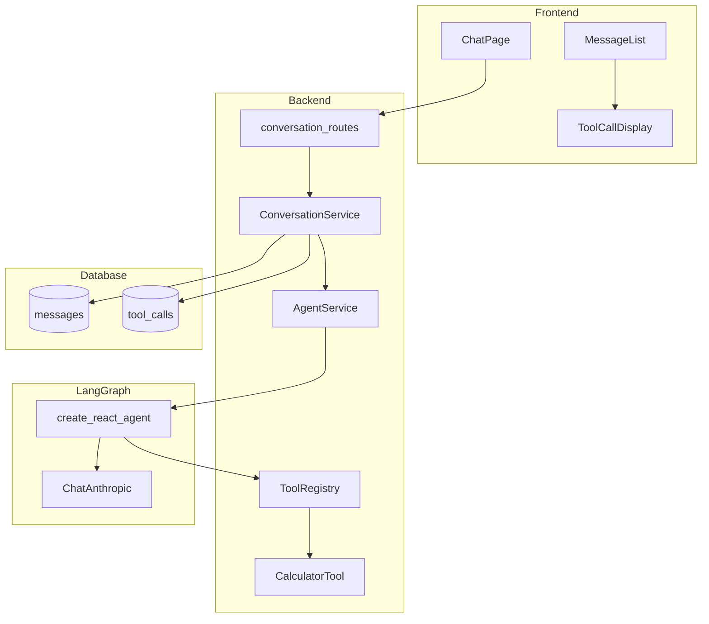
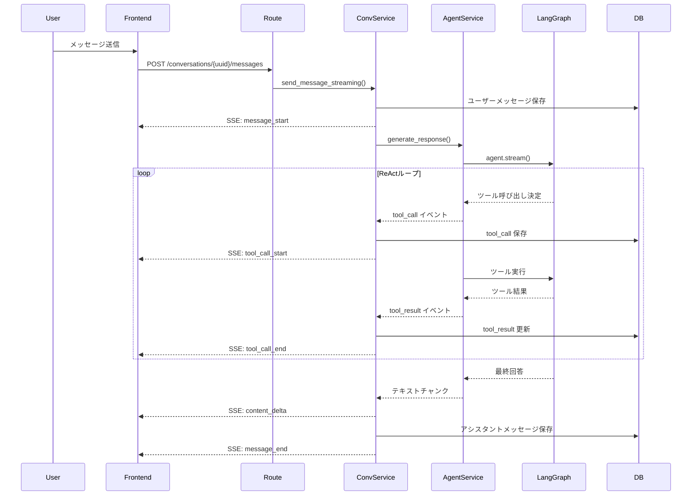

# エージェント機能の実装

## 概要
現在のシンプルなChatAIをAgentAIに作り変える

### 要件
- 簡単な計算ができるツールを使いこなすエージェントを作成する
- langchain, langgraphを用いる
- ツールの追加が簡単に行えるように設計する
- llmプロバイダーも、今後複数対応することを目標とする(今はanthropicのみで良い)
- ツールの入力・出力も画面に表示する(エクスパンダーによって、普段は見えないようにする)
- ツールの入出力もDBに保存する

### 参考
以下はlanggraphの使い方の例です。
```
"""
LangGraphのprebuilt ReActエージェント（推奨）

ポイント
- create_react_agent が「LLMノード ↔ ツールノード」のループを持つグラフを返す
- 入力は messages（会話履歴）で渡す
- stream() で途中経過も取得できる
"""

# pip例:
#   pip install -U langgraph langchain-openai

from langgraph.prebuilt import create_react_agent
from langchain_openai import ChatOpenAI
from langchain_core.tools import tool


@tool
def check_weather(location: str) -> str:
    """指定された場所の天気を返す（デモ）。"""
    return f"{location}はいつでも快晴（デモ）"


model = ChatOpenAI(model="gpt-4o-mini", temperature=0)

# prompt は「システムプロンプト」として渡す（文字列ならSystemMessage扱い）
graph = create_react_agent(
    model,
    tools=[check_weather],
    prompt="あなたは簡潔で正確なアシスタントです。必要ならツールを使ってください。"
)

inputs = {"messages": [{"role": "user", "content": "sfの天気は？"}]}

# 途中経過も見たい場合（updatesで差分が流れる）
for chunk in graph.stream(inputs, stream_mode="updates"):
    print(chunk)

# 最終結果だけ欲しい場合
final_state = graph.invoke(inputs)
print(final_state["messages"][-1].content)
```

---
## 実装仕様

### 1. 要件分析

#### 1.1 現状
現在のシステムは、Anthropic APIを直接使用したシンプルなチャットボットです：
- `AIService` が直接 `anthropic.Anthropic` クライアントを使用
- メッセージは `user` と `assistant` の2つのロールのみ
- ストリーミングは単純なテキストチャンクのみ

#### 1.2 目標

| 要件 | 詳細 |
|------|------|
| **エージェント化** | 単純なチャットからツールを使いこなすエージェントへ変換 |
| **ツール実装** | 簡単な計算ができるツール（四則演算）を実装 |
| **フレームワーク** | langchain, langgraph を使用し、`create_react_agent` パターンを採用 |
| **拡張性（ツール）** | ツールの追加が容易な設計（ツールレジストリパターン） |
| **拡張性（LLM）** | 将来的にAnthropic以外のプロバイダーにも対応可能な設計 |
| **UI表示** | ツールの入力・出力をエクスパンダー付きで画面表示 |
| **データ永続化** | ツールの入出力をDBに保存 |

---

### 2. ロジック・処理設計

#### 2.1 全体アーキテクチャ



#### 2.2 データフロー



#### 2.3 SSEイベント設計

| イベント名 | タイミング | データ構造 |
|-----------|-----------|-----------|
| `message_start` | ユーザーメッセージ保存後 | `{user_message_id: int}` |
| `tool_call_start` | ツール呼び出し開始時 | `{tool_call_id: int, tool_name: string, input: object}` |
| `tool_call_end` | ツール実行完了時 | `{tool_call_id: int, output: string, error: string\|null}` |
| `content_delta` | LLMテキスト生成時 | `{delta: string}` |
| `message_end` | 全処理完了時 | `{assistant_message_id: int, content: string, tool_calls: array}` |
| `error` | エラー発生時 | `{error: string, user_message_id?: int}` |

#### 2.4 データベーススキーマ拡張

**新規テーブル: `tool_calls`**

```sql
CREATE TABLE tool_calls (
    id BIGINT PRIMARY KEY AUTO_INCREMENT,
    message_id BIGINT NOT NULL,
    tool_call_id VARCHAR(64) NOT NULL,  -- LangGraphが生成するID
    tool_name VARCHAR(100) NOT NULL,
    input JSON NOT NULL,
    output TEXT,
    error TEXT,
    status ENUM('pending', 'success', 'error') NOT NULL DEFAULT 'pending',
    started_at TIMESTAMP NOT NULL DEFAULT CURRENT_TIMESTAMP,
    completed_at TIMESTAMP,
    FOREIGN KEY (message_id) REFERENCES messages(id) ON DELETE CASCADE,
    INDEX idx_tool_calls_message_id (message_id),
    INDEX idx_tool_calls_tool_call_id (tool_call_id)
);
```

**messages テーブル変更なし**
- `role` は引き続き `user` と `assistant` のみ
- ツール情報は `tool_calls` テーブルで管理

#### 2.5 ツールレジストリ設計

```
backend/app/tools/
├── __init__.py          # ToolRegistry クラス
├── base.py              # ツール基底クラス（将来拡張用）
└── calculator.py        # 計算ツール実装
```

**ツール追加手順（将来）：**
1. `backend/app/tools/` に新規ファイル作成
2. `@tool` デコレータでツール関数を定義
3. `ToolRegistry.register()` で登録
4. 自動的にエージェントで利用可能に

#### 2.6 LLMプロバイダー抽象化

LangChainの `init_chat_model` を使用し、環境変数でプロバイダーを切り替え可能にします：

```
# 現在（Anthropic）
LLM_PROVIDER=anthropic
LLM_MODEL=claude-sonnet-4-5-20250929

# 将来（OpenAI）
LLM_PROVIDER=openai
LLM_MODEL=gpt-4o
```

#### 2.7 フロントエンドコンポーネント設計

```
frontend/src/components/chat/
├── MessageList.tsx       # 既存（変更）
├── MessageItem.tsx       # 既存（変更）
├── ToolCallItem.tsx      # 新規：ツール呼び出し表示
└── ToolCallExpander.tsx  # 新規：折りたたみUI
```

**ToolCallExpander 動作：**
- デフォルト：折りたたみ状態（入力・出力は非表示）
- クリックで展開：ツール名、入力JSON、出力結果を表示
- ステータスアイコン：実行中（スピナー）、成功（✓）、エラー（✗）

---

### 3. 修正スコープ

#### 3.1 新規作成

| ファイル | 説明 |
|---------|------|
| `backend/app/tools/__init__.py` | ToolRegistryクラス、ツール一覧管理 |
| `backend/app/tools/base.py` | ツール基底クラス（オプション） |
| `backend/app/tools/calculator.py` | 四則演算ツール（add, subtract, multiply, divide） |
| `backend/app/models/tool_call.py` | ToolCall SQLAlchemyモデル |
| `backend/app/schemas/tool_call.py` | ToolCall Pydanticスキーマ |
| `backend/app/repositories/tool_call_repository.py` | ToolCallリポジトリ |
| `backend/app/services/agent_service.py` | LangGraph ReActエージェント統合 |
| `infra/mysql/migrations/002_add_tool_calls_table.sql` | マイグレーションSQL |
| `frontend/src/types/tool.ts` | ツール関連型定義 |
| `frontend/src/components/chat/ToolCallItem.tsx` | ツール呼び出し表示コンポーネント |
| `frontend/src/components/chat/ToolCallExpander.tsx` | エクスパンダーUI |

#### 3.2 既存ファイル変更

| ファイル | 変更内容 |
|---------|---------|
| `backend/pyproject.toml` | `langgraph`, `langchain-anthropic` 依存追加 |
| `backend/app/services/ai_service.py` | 非推奨化（agent_service.pyに移行）または削除 |
| `backend/app/services/conversation_service.py` | `AgentService` への委譲、ツール呼び出しイベント処理 |
| `backend/app/routes/conversation_routes.py` | 新規SSEイベント（`tool_call_start`, `tool_call_end`）追加 |
| `backend/app/schemas/conversation.py` | `MessageResponse` にツール呼び出し情報追加 |
| `backend/app/models/__init__.py` | `ToolCall` モデルのexport追加 |
| `infra/mysql/init/001_init.sql` | `tool_calls` テーブル定義追加 |
| `frontend/src/types/chat.ts` | `ToolCall` 型追加、`Message` 型拡張 |
| `frontend/src/lib/api/conversations.ts` | 新規SSEイベントのコールバック追加 |
| `frontend/src/hooks/useChat.ts` | ツール呼び出し状態管理追加 |
| `frontend/src/hooks/useNewConversation.ts` | ツール呼び出し状態管理追加 |
| `frontend/src/components/chat/MessageList.tsx` | `ToolCallItem` のレンダリング追加 |
| `frontend/src/components/chat/MessageItem.tsx` | ツール呼び出し表示の統合 |

---

### 4. 最終要件チェックリスト

| # | 要件 | 完了条件 |
|---|------|---------|
| 1 | LangGraph統合 | `create_react_agent` を使用したエージェントが動作すること |
| 2 | 計算ツール | 四則演算（加算・減算・乗算・除算）が正しく実行できること |
| 3 | ツール追加容易性 | 新規ツールファイル作成 → レジストリ登録のみで追加可能なこと |
| 4 | LLMプロバイダー拡張性 | 環境変数切り替えでAnthropicを使用可能なこと（将来的にOpenAI等にも対応可能な設計） |
| 5 | ツールI/O表示 | フロントエンドでツール名・入力・出力が確認できること |
| 6 | エクスパンダーUI | ツール情報がデフォルト折りたたみ、クリックで展開できること |
| 7 | DB永続化 | `tool_calls` テーブルにツール呼び出し履歴が保存されること |
| 8 | ストリーミング対応 | ツール実行中もSSEでリアルタイム更新されること |
| 9 | エラーハンドリング | ツール実行エラー時に適切なエラー表示・DB記録がされること |
| 10 | 既存機能維持 | ツールを使わない通常の会話が引き続き正常動作すること |
